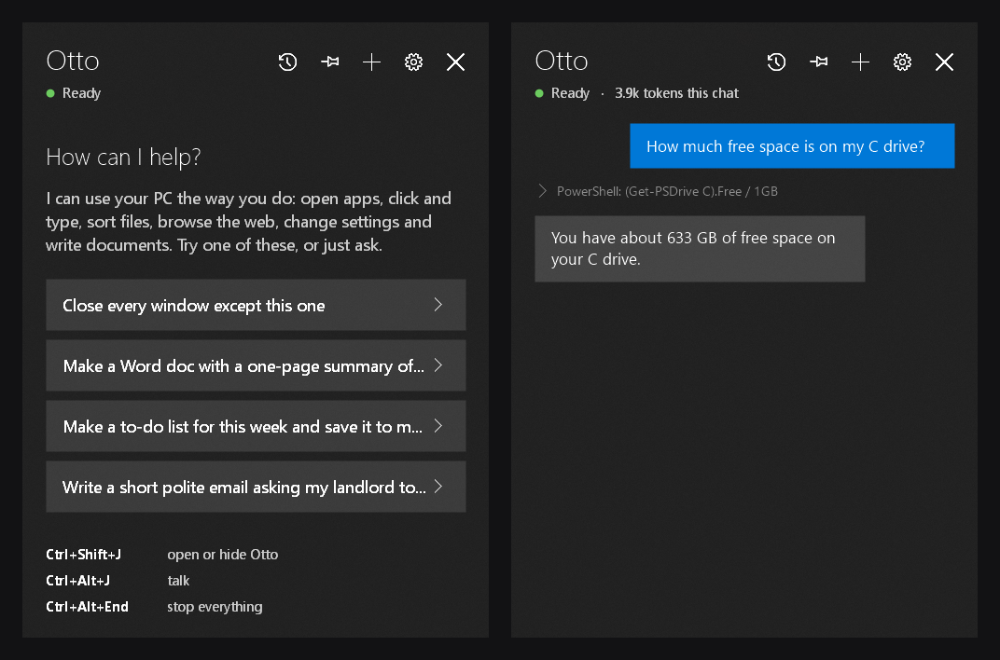

<p align="center"></p>

# Otto

**Operates Tasks Through Onscreen controls.** Otto is an AI assistant for Windows that uses your PC the way you do. It can see the screen, click, type, scroll, open apps, sort files, browse the web, change settings, and read and write your email.

It lives in the system tray. Press **Ctrl+Shift+J** and a panel slides in from the right, like the Windows 10 Action Center. Ask for something and Otto does it. While it's working, a soft glow around the screen shows that it has the mouse and keyboard.



> **Read the [safety notes](#safety) before you use it.** Otto can control your computer with very few restrictions. That's the point of it, but it's also the risk.

## What it can do

- **See and control the screen.** It reads windows through Windows' accessibility interface (cheap and accurate), and uses screenshots when it needs to see something visual. It can click, type, drag, scroll and press shortcuts.
- **Work with your apps and files.** It can open any installed app by name, manage windows, read and write files (including `.docx`), and run PowerShell.
- **Use the web.** It searches, reads pages, and works inside your normal browser.
- **Email and calendar** (experimental) for Outlook, Hotmail and Microsoft 365: list, read, draft and send email (always with your approval), and check or add calendar events.
- **Remember things.** It keeps short notes about your apps and preferences, and saves multi-step jobs as routines that replay later without the AI.
- **Voice.** Push-to-talk dictation (Ctrl+Alt+J). It uses Windows' online speech engine, or your AI provider transcribes the recording (Gemini and OpenAI). What you said goes into the message box for you to check before sending. Otto can also read replies aloud.
- **Message controls.** Hover a message to copy it, retry Otto's last answer, edit and resend your last message, or undo what Otto just did. Right-click for more.
- **Chat history.** Every chat is saved. The history icon lists them by day with a preview of each, so you can reopen or delete one. + starts a new chat without losing the last.
- **Attachments.** Drag files onto the panel, or paste a screenshot with Ctrl+V. Otto sees images and works with files by their path.
- **Updates.** Once a day Otto quietly checks for a new release. If there is one, a small bar in the panel offers to update: one click downloads it and restarts Otto, keeping your settings, keys and chats. You can turn the check off in settings.
- **Stop and pin.** While Otto has control, a Stop button sits beside the banner. The pin icon keeps the panel open when you click elsewhere.
- **Pick your AI.** It works with Anthropic (Claude, the default and the most tested), OpenAI, Google Gemini, xAI Grok, DeepSeek, OpenRouter, or a local model through Ollama or LM Studio. You can save several keys per provider, and Otto moves to the next one by itself when a key runs out of quota.

## Requirements

- Windows 10 (version 2004 or later) or Windows 11
- An API key from one of the providers above. Claude works best: https://console.anthropic.com/settings/keys

## Install

**The easy way (no programming tools needed):**

1. Download `Otto-x.y.z.zip` from the [latest release](../../releases/latest) and unzip it.
2. Move `Otto.exe` somewhere permanent, for example `C:\Users\<you>\Otto\`, then double-click it.
3. Otto opens its settings on first start. Choose an AI provider and paste your API key. The key is stored in Windows Credential Manager, never in a file.
4. If you want it to start with Windows, right-click Otto's tray icon and tick **Start with Windows**.

Windows SmartScreen may say it "protected your PC" because the program isn't signed. Click **More info → Run anyway**. Some antivirus products may also be wary of a program that sends keystrokes and runs PowerShell. The full source is here, so you can check what it does.

**From source (for developers):**

You need Windows 10 (version 2004 or later) or 11, and the [.NET 8 SDK](https://dotnet.microsoft.com/download/dotnet/8.0). Double-click **`Install Otto.cmd`**. It builds Otto, installs it to `%LOCALAPPDATA%\Programs\Otto` with Start menu and desktop shortcuts, and sets it to start with Windows. Run it again after changing the code. **`Uninstall Otto.cmd`** removes it again; it keeps your notes and keys unless you run `uninstall.ps1 -All`. `publish.ps1` builds the release download. Bump `<Version>` in `Otto.csproj` before publishing a new release, so installed copies see it as newer. `dotnet test tests/Otto.Tests` runs the unit tests (no API calls; they write only to a temp folder).

## Using it

| Key | What it does |
|---|---|
| Ctrl+Shift+J | Open or hide the panel |
| Ctrl+Alt+J | Push-to-talk: press, speak, press again |
| Ctrl+Alt+End | **Stop everything immediately** |

The gear icon opens the settings: AI provider and key, models, email sign-in, reply animation and read-aloud.

Otto asks before anything with real consequences: buying or paying, signing something, submitting a formal document, sending an email, permanently deleting files, or running PowerShell that deletes things or changes Windows itself. Everything else, it just does. If it overwrites a file, the old version is backed up first.

## Safety

Please take these seriously:

- **Otto has real control of your PC.** It moves the real mouse and keyboard and can run commands. Keep **Ctrl+Alt+End** in mind, and don't leave it running unattended on things you care about.
- **Prompt injection.** A web page, document or email can contain text written to trick an AI ("ignore your instructions and..."). Otto is told to treat everything it reads as data, never as instructions, but no AI does that perfectly. Be careful letting it browse untrusted sites with your accounts signed in.
- **It never types passwords or card numbers**, by design. Sign in to things yourself.
- **Set a spending limit** with your AI provider (for Anthropic, in the console under Limits).

## Privacy

- What Otto sees (screen text, screenshots, files it reads, emails it opens) is sent to the AI provider you chose, so it can decide what to do. Close anything sensitive first, or use a local model.
- Your API keys and email sign-in are stored in Windows Credential Manager, encrypted by Windows. Otto never sees your email password: you sign in on Microsoft's own page.
- Saved chats, notes, routines, custom sounds and file backups live in `%LOCALAPPDATA%\Otto`. Images and screenshots aren't kept in saved chats. Settings live in the registry under `HKCU\Software\Otto`.

## Costs

You pay your AI provider directly. With the default Claude setup (Haiku for everyday steps, Sonnet only when a task is hard), typical tasks cost **a few US cents**. The panel shows a running total for each chat. Otto keeps costs down by reading the screen as text instead of pictures where it can, batching actions, caching, trimming old screen readings, and replaying saved routines without the AI.

## Email and calendar setup (Outlook / Hotmail)

This feature is experimental and hasn't been fully tested yet.

Microsoft requires every app that reads Outlook mail to register itself once. It's free and takes about 5 minutes:

1. Go to the [Azure app registrations page](https://portal.azure.com/#view/Microsoft_AAD_RegisteredApps/ApplicationsListBlade) and sign in with any Microsoft account.
2. Click **New registration** and name it `Otto`.
3. Under **Supported account types**, choose *Accounts in any organizational directory and personal Microsoft accounts*.
4. Leave Redirect URI empty and click **Register**.
5. Open **Authentication**, set **Allow public client flows** to **Yes**, and save.
6. Copy the **Application (client) ID** into Otto's settings and click **Sign in**. You'll get a code to enter at microsoft.com/devicelogin.

Otto only asks for permission to use your mail and calendar.

## Customising

- **Sounds:** put `.wav` files in `%LOCALAPPDATA%\Otto\sounds` to replace any of Otto's sounds. The names are `send`, `reply`, `type`, `takeover`, `listen-on`, `listen-off`, `attention` and `error`. Restart Otto after adding them.
- **Free voice recognition:** turn on *Online speech recognition* in Windows Settings → Privacy → Speech. Otherwise voice needs Gemini or OpenAI as your provider, which transcribe it using a little of your API allowance.
- **Icons:** `assets/make_icons.py` draws them (it needs Pillow).

## Limitations

- It only sees and controls the main monitor.
- Windows doesn't let it click into apps running as administrator, or into UAC prompts.
- Providers other than Claude work, but get less testing, and some are weaker at multi-step PC control. DeepSeek can't see images.
- Some antivirus products may flag PowerShell commands that Otto runs.

## For developers

It's plain C# / WinForms on .NET 8, with no UI framework. Some useful entry points:

| File | What's in it |
|---|---|
| `Agent.cs` | The tool-use loop, model switching, history trimming and summaries |
| `Llm.cs` | Anthropic and OpenAI-compatible streaming connectors |
| `Desktop.cs`, `Input.cs`, `UiTree.cs` | Screenshots, mouse and keyboard, and reading windows as text |
| `Tools.cs`, `Apps.cs`, `Graph.cs`, `Memory.cs` | The tools Otto can call |
| `ChatPanel.cs`, `ChatView.cs`, `Overlay.cs` | The panel and the glow |

Debug switches (none of them use API credits, except `--api-test`):

```powershell
Otto.exe --api-test "first message || second message"   # headless chat, log in %TEMP%\otto-api-test.txt
Otto.exe --dump-ui                                       # what Otto "sees" of the front window
Otto.exe --bench                                         # timings of the local work per step
Otto.exe --overlay-demo                                  # preview the glow
Otto.exe --settings                                      # just the settings window
Otto.exe --search "query"                                # what the web_search tool returns
Otto.exe --render-ui                                     # draws the chat and history views to PNGs in %TEMP%
```

## License

Made by [bam-rip](https://github.com/bam-rip). MIT licensed, see [LICENSE](LICENSE).
